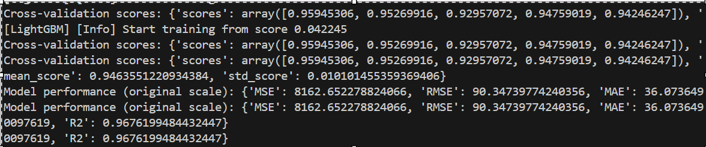
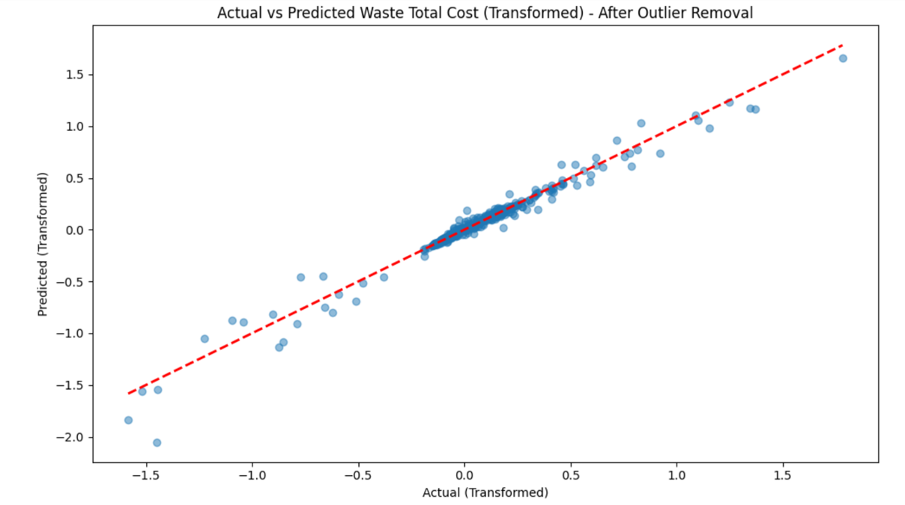
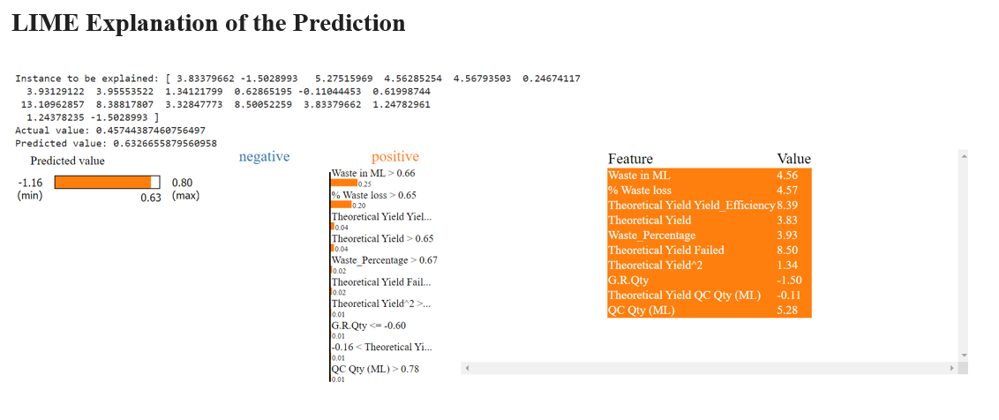

# Waste Cost Prediction Model 🏭💰

## 📊 Project Overview

This project implements a machine learning model to predict waste costs in manufacturing processes. By analyzing various production factors, the model aims to help industries optimize their processes and reduce waste-related expenses.

## 🚀 Features

- Data preprocessing and cleaning
- Feature engineering and selection
- Implementation of stacking regressor model
- Model evaluation and cross-validation
- Visualization of results
- Configurable parameters
- Comprehensive error handling and logging

## 🛠️ Installation

git clone https://github.com/dimplefrancis/waste-cost-prediction.git
cd waste-cost-prediction
pip install -r requirements.txt

## 🏃‍♂️ Usage
python main.py

## 📁 Project Structure

waste-cost-prediction/
│
├── data/
│   ├── data_batch.csv
│   └── data_fail.csv
│
├── data_preparation.py
├── feature_engineering.py
├── model.py
├── evaluation.py
├── utils.py
├── main.py
└── README.md

## 📊 Results

The model's performance is evaluated using various metrics, including R-squared score, Mean Squared Error (MSE), and cross-validation scores. Visualizations of actual vs. predicted values are generated for both transformed and original scales.

### Model Performance

- **Cross-validation scores:**
  - Fold 1: 0.95945306
  - Fold 2: 0.95269916
  - Fold 3: 0.92957072
  - Fold 4: 0.94759019
  - Fold 5: 0.94246247

- **Mean Cross-validation R2 Score:** 0.9463551220934384
- **Standard Deviation of Cross-validation Scores:** 0.010101455359369406

### Model Performance (Original Scale)

- **Mean Squared Error (MSE):** 8162.65227882406
- **Root Mean Squared Error (RMSE):** 90.34739774240356
- **Mean Absolute Error (MAE):** 36.0736490097619
- **R-squared (R2):** 0.9676199484432447

### Visualization of Results

The plot shows a strong correlation between actual and predicted values, indicating good model performance.

### LIME Explanation of the Prediction

The LIME explanation provides insights into feature importance for individual predictions:

- **Top positive contributors:** Waste in ML, % Waste loss, Theoretical Yield Yield_Efficiency
- **Top negative contributors:** Theoretical Yield, G.R.Qty

This explanation helps understand which features are most influential in the model's predictions for specific instances.

### Interpretation

1. **High R2 Score:** The model explains approximately 96.76% of the variance in the target variable, indicating excellent predictive power.
2. **Consistent Performance:** Cross-validation scores show consistent performance across different subsets of the data, with a high mean R2 of 0.9464.
3. **Accurate Predictions:** Low RMSE and MAE values suggest the model's predictions are close to actual values on average.
4. **Feature Importance:** The LIME explanation reveals that waste-related features and theoretical yield are crucial in predicting total waste cost.
5. **Outlier Handling:** The "After Outlier Removal" note in the plot title suggests that data preprocessing has improved model performance.

### Implications

- The model demonstrates strong potential for accurate waste cost predictions in manufacturing processes.
- It can be a valuable tool for identifying factors that contribute most to waste costs, enabling targeted process improvements.
- The consistent performance across cross-validation folds indicates good generalization to unseen data.

🔧 Configuration
You can adjust various parameters of the model and data processing in the config.py file, including:

Data file paths
Missing value handling strategies
Feature engineering parameters
Model hyperparameters
Logging settings

🐛 Error Handling
The project implements comprehensive error handling and logging. Errors are categorized into DataError and ModelError, and all functions are decorated with an error_handler that logs any exceptions.

📝 License
This project is MIT licensed.